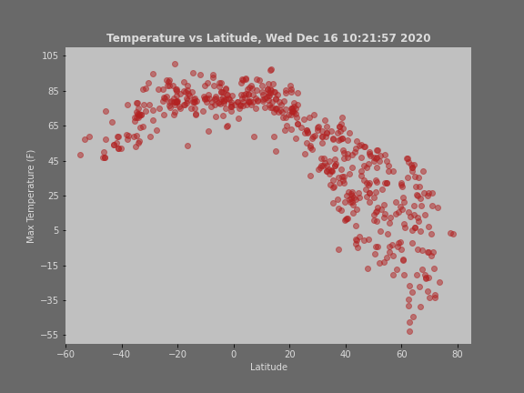
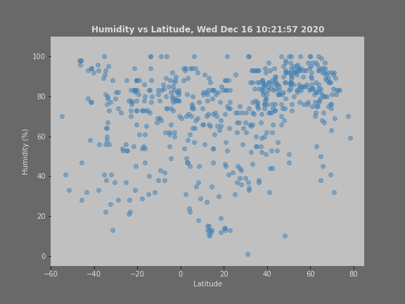
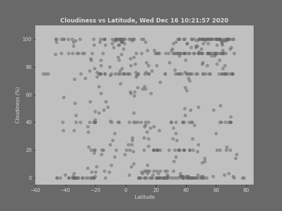
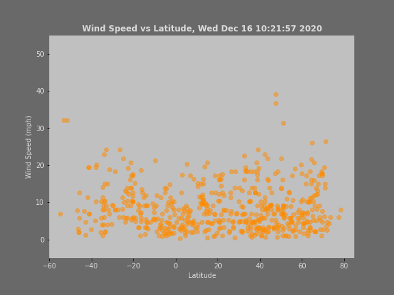

# python-api-challenge
Python API Homework - What's the Weather Like?

Code was created using **Jupiter Notebook 6.0.3 /Python 3.8.3**
# Part 1 Weather_py

## Files/Results
Jupiter  Notebook - [WeatherPy.ipynb](weather_py/V)
Report is included in the notebook 
## Observations
# 1. Scatter plots 

Temperature/Humidity/Cloudiness/Wind Speed vs Latitude

## 1. Summary statistics table: