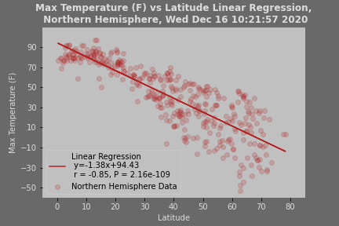
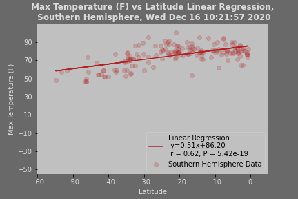
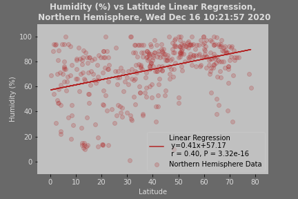
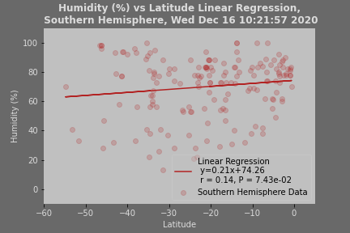
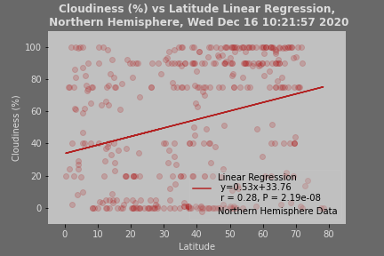
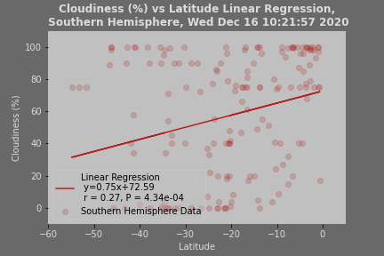
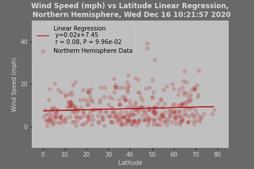
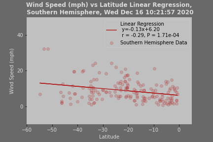

# python-api-challenge

Python API Homework - What's the Weather Like?

Code was created using **Jupiter Notebook 6.0.3 /Python 3.8.3**
# Part 1 Weather_py

## Files/Results
Jupiter  Notebook - [WeatherPy.ipynb](weather_py/V)
Report is included in the notebook 
## Observations
## 1. Scatter plots 

### Temperature & Humidity vs Latitude

Observations

### Cloudiness & Wind Speed vs Latitude

Observations

## 2. Linear Regressions:
Temperature vs Latitude

Observations

### Humidity vs Latitude

Observations

### Cloudiness vs Latitude

Observations

### Wind Speed vs Latitude

