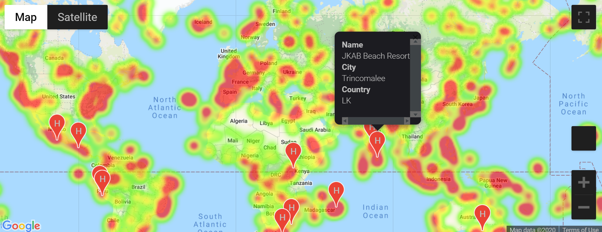

# python-api-challenge

Python API Homework - What's the Weather Like?

Code was created using **Jupiter Notebook 6.0.3 /Python 3.8.3**
# Part 1 Weather_py

## Files/Results
Jupiter  Notebook - [WeatherPy.ipynb](weather_py/WeatherPy.ipynb)
Report is included in the notebook 
## Observations
## 1. Scatter plots 

### Temperature & Humidity vs Latitude

Observations:
Temperature Latitude scatter shows trend of temperature reduction with latitude scalar going up , and nothern hemisphere has longer tail as we van observe winter season.
Humidity scatter is more ecenly spread on latitude, with some dense areas 

### Cloudiness & Wind Speed vs Latitude

Observations
scatter of cloudiness vs latitude - we can observe some grouping around 0, 20, 40, 75, 90, 100% lines ... this could be due to the way cloudiness is measured/evaluated.
scatter of wind speed vs latitude - we can observe some grouping below 10 mph

## 2. Linear Regressions:

### Temperature vs Latitude

Observations
we can observe ver strong positive correlation between latitude and temperature for S. Hemisphere , and even stronger negative correlation between latitude and temp in northern hemisphere ( due to winter time in Nothern hemisphere it is stornger)

### Humidity vs Latitude

Observations
Both hemisphere's humidity vs latitude correlations are positive , and northern hemispshere is somewhat stronger - coef of correlation 0.4 vs 0.2 . However this relationship might be affected by cloudiness

### Cloudiness vs Latitude

Observations
Both hemisphere's cloudiness vs latitude correlations are positive, but correlation is weak - similar to humidity

### Wind Speed vs Latitude

#
# Part 2 Weather_py
## Files/Results

Jupiter  Notebook - [VacationPy.ipynb](vacation_py/VacationPy.ipynb)
Report is included in the notebook 

Heatmap of Humidity, Hotels labels indicating hotels with perfect weather conditions
- temp: 70-80 deg F, almost no clouds, almost no wind

